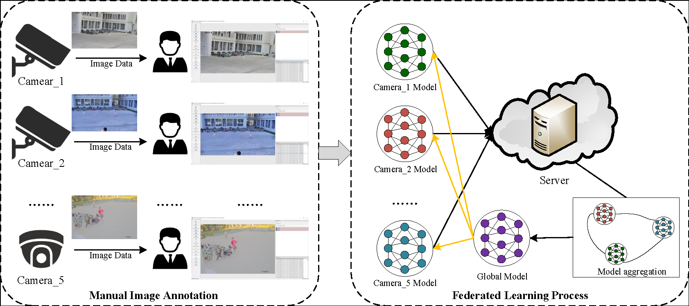
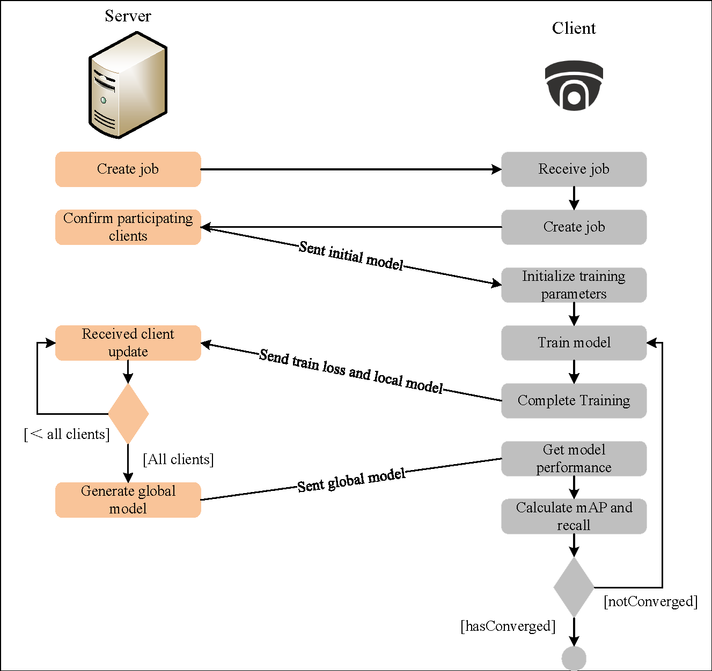
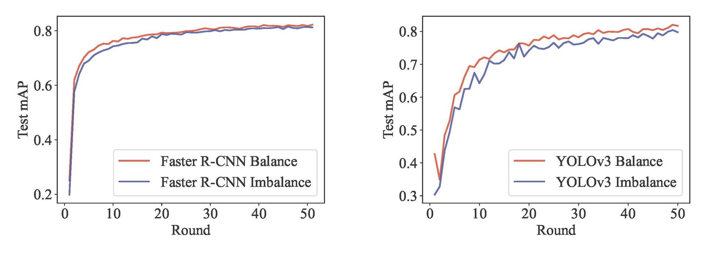
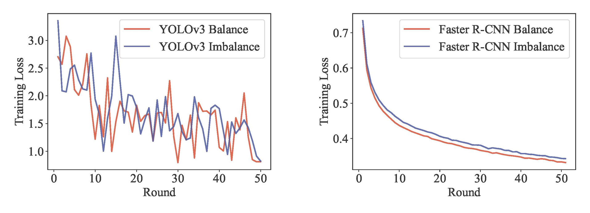

# NIPD: A Federated Learning Person Detection Benchmark Based on Real-World Non-IID Data


We will introduce the construction of a federated vision system using data scattered across cameras in the wireless IoT federated learning scenario, as shown below:

<div align=center>

</div>

For some literature on federal vision, you can refer to the following links:

* [FedVision: An Online Visual Object Detection Platform Powered by Federated Learning](https://arxiv.org/abs/2001.06202)

* [Real-World Image Datasets for Federated Learning](https://arxiv.org/abs/1910.11089)

This code is based on **FedVision** architecture.

We use **flask _ socketio** as the communication method between the server and the client. The communication process between the server and the client is as follows:

<div align=center>

</div>

If it is trained under the same server, in order to enhance the stability and efficiency of communication, the model aggregation efficiency is greatly improved by using the form of saving the model parameter file and allowing the server to read the model file directly (our code supports SocketIO communication, which allows researchers to **choose their own way** of obtaining the client model from the server).


## 1 Data set preparation

The data set can be obtained in the following two ways:
- NIPD Data set: URL：https://pan.baidu.com/s/1aMJv5C634krTiQ4PkrYuvg?pwd=z9rc password：z9rc 


- Street Data set: This dataset was created by WeBank and is currently **only open to students**. If you are a student, you can register with edu. Readers can access the [website](https://dataset.fedai.org/#/datasetfed) to register and obtain data.


- **Using external public data sets**. Readers can also directly use external common object detection data sets to run their own code ( it may be necessary to modify the deep learning model due to different data sets ). Common object detection data sets include:

  * [PASCAL VOC](http://host.robots.ox.ac.uk/pascal/VOC/)
  * [MS COCO](https://cocodataset.org/#download)

  After obtaining the data set, readers can segment the dataset according to their actual needs.

  

## 2 Experimental environment

You need to prepare the following environment：

* Install PyTorch with GPU version. 
* Install flask_socketio. 
* Other installation environment, you can view the **requirements.txt file**, and execute the following code for installation:
	```
	pip install -r requirements.txt
	```


## 3 Use Code

After downloading the data set and installing the necessary running environment, you can execute the code according to the following steps:
* First, execute the following command to start the server:：
  
    ```
    sh ./run_server.sh dataset model port
    ```
  There are three input parameters:
  1. dataset: dataset name. Options include "noniid_person", "street_5", "street_ 20”.
  2. model: model parameter, including "fast" and "yolo".
  3. port: port number, which is set by the user.   
	
  For example, the server uses the NIPD dataset to train the YOLOv3 and executes the following command:
  ```
  sh ./run_server.sh noniid_person yolo 1234
  ```
	
	
* Then execute the following command to start the client:
    ```
    sh ./run.sh dataset gpu_id model port
    ```
  The client startup includes four input parameters:
	
	1. dataset: dataset name. Options include "noniid_person", "street_5", "street_ 20”.
	
	2. gpu_id：if multiple client scenarios are simulated in the local environment, each client needs a separate GPU resource for local training. Therefore, in order to prevent clients from being bound to the same GPU core for execution, the program will be interrupted due to insufficient video memory. We can assign each client to a different GPU core for execution; If it is executed in a distributed environment, that is, each client runs in a separate device, then this parameter can be set at will.
	
	3. model：model parameter, including "fast" and "yolo".
	
	4. port：port number, which is set by the user.
	
  For example, the client uses the NIPD dataset to train the YOLOv3 and executes the following command:

  ```
  sh ./run.sh noniid_person 5 yolo 1234
  ```
	
	   

* During the running process, if you want to forcibly terminate the code, you can also execute the following command to forcibly terminate the code:
    ```
    sh ./stop.sh noniid_person yolo
    ```


## 4 Experimental example
We use YOLOv3 and Faster R-CNN models respectively to test the results of joint modeling of NIPD dataset in the federated learning scenario.We trained 50 rounds according to the default parameters, and the results of mAP are shown in the following figure:

<div align=center>

</div>
The change result of the loss value with the number of iterations is as follows:

<div align=center>

</div>
